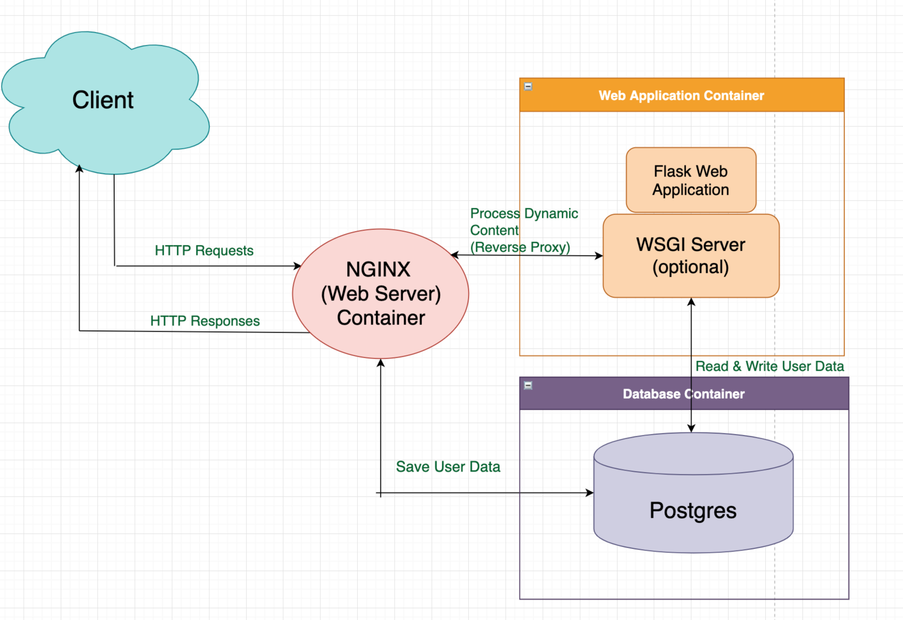
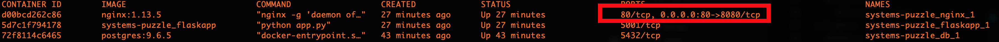
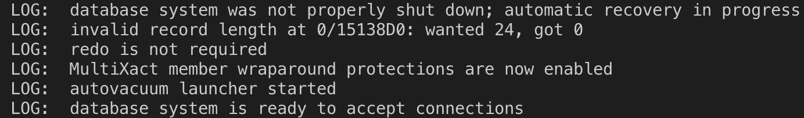

# System-Puzzle-Insight
Thought process and debugging system puzzle for Insight DevOps program


## 1. Understanding the Compments of the Architecture

In this project, the developer is using Postgres for the backend database, the Python Flask framework as an application server, and Nginx as a web server. The general Architecture diagram looks like the following:

<p align="center"></p>

Nignx is a web server that handles HTTP requests that come from the clients. Based on how you configure Nginx, it can directly provide the static connect back to the clients. Additionally, it can reverse proxy the requests to the WSGI (Gunicorn, Apache, etc) server to generate the dynamic content in the Flask web application to be delivered back to the user.

Briefly underderstanding the usage of each components, next step is to run the containers and debug the issues.

## 2.Degbuggig the whole Architecture

Docker Compose is a tool for defining and running multi-container Docker applications. In our `docker-compose.yml` file, we have about 4 main services:

 * db: our Postgres database for storing the clients' data.
 * flaskapp: a computer program implemented in Flask to perform the tasks over the internet.
 * nginx: web server to handle the HTTP requests. 
 * network: enable communication between the webapp and database containers running on the same daemon host.
 
 After running these 3 commands 
 
```
docker-compose up -d db
docker-compose run --rm flaskapp /bin/bash -c "cd /opt/services/flaskapp/src && python -c  'import database; database.init_db()'"
docker-compose up -d
```
We got `localhost refused to connect` error by nevagating to `localhost:8080`, which means something wrong with the Nginx.

### Issue1. Port Mapping

when enabling client access to web server application from the internet, we usually map Docker container 80 to the host machine port 8080 (since we expose 8080 for localhost). By convention, we use `8080:80` which is `host port : container port` in docker-compose file

Also by running `docker ps -a` to list all the containers, running and otherwise. We spot something suspicious



Hence, we have to fix the order of the mapping ports in the docker-compose yaml file to `8080:80`  

### Issue2. Wrong Port Exposing

After deleting all running containers and re-executing the commands, we got the new error message, which is `502 Bad Gateway`. 
By googling this error, we could narrow down to one reason: 

`Nginx with other services/apps: try restarting the other service behind nginx and explore the logs to find the reason why it happened`

Then we are trying to inspect the logs for the Nginx and Flaskapp by running `docker-compose logs <service-name>`, we found this error from Nginx logs.  

` [error] 7#7: *1 connect() failed (111: Connection refused) while connecting to upstream, client: 172.20.0.1, server: localhost, request: "GET / HTTP/1.1", upstream: "http://172.20.0.2:5001/", host: "localhost:8080"`

The error is regarding refused connection to upstream, which exposes the port 5001. 
Then we review the logs from flaskapp, which shows as follows:

`
flaskapp_1  |  * Serving Flask app "app" (lazy loading)
flaskapp_1  |  * Environment: production
flaskapp_1  |    WARNING: This is a development server. Do not use it in a production deployment.
flaskapp_1  |    Use a production WSGI server instead.
flaskapp_1  |  * Debug mode: off
flaskapp_1  |  * Running on http://0.0.0.0:5000/ 
`

We can see that the webapp is running on default port 5000, which are not matching to the upstream port. Next, we have inspect the flaskapp configfile and Dockerfile (used to build the docker image), the port is exposed to 5001, we just simply change it to 5000. Finally, we got the Welcome page by go to `localhost:8080`

### Issue3. HTTP Header Redundancy

After filling in the correct data in the form, the page got directed to `http://localhost%2Clocalhost:8080/success` instead of 
`http://localhost:8080/success`, it looks like we have redundant localhosts in our HTTP header. Thus, we revisit the config file for the webapp to how the headers setup. We spot that there are actually 2 Host headers in the file. Then we simply comment out the first one, and re-run the containers. Finally, we got re-directed to the correct Success page. However, new issus comes out.

### Issue4: 

In the Success page, we did not see the data that we just typed in. It seems that the data was not read in the Postgres database from web app. To confirm my initial thought, first, I view the logs from databse container


